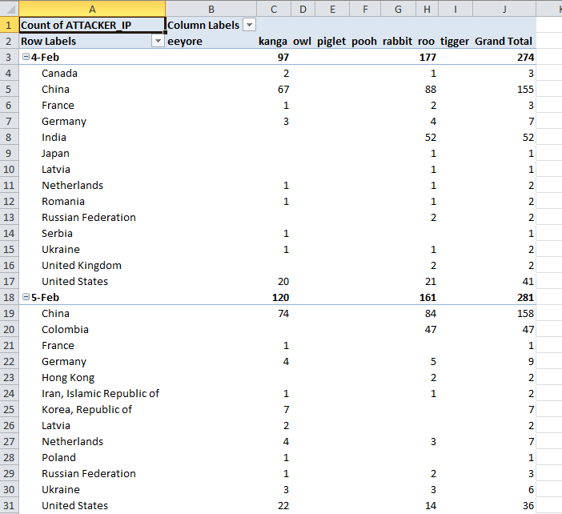

# Honey Pot Project
A basic honey pot project.  Built on the [Modern Honey Network architecture](http://threatstream.github.io/mhn/)

The contribution in this repository is an Excel workbook that parses MHP api feeds to produce a data table.

Raw feed from Modern Honey Network server

After parse

Pivot

